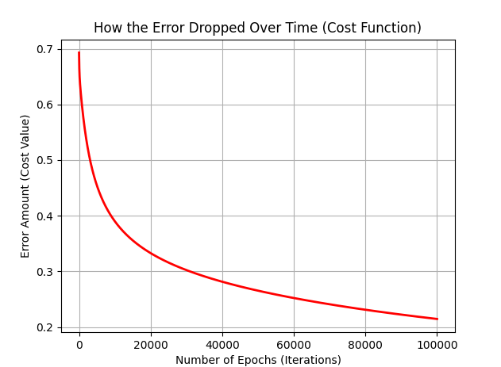
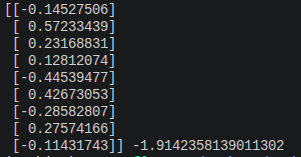

# Logistic Regression from Scratch

This project implements a **Logistic Regression model from scratch** using Python. It uses only basic libraries (`NumPy`, `Pandas`, and `Matplotlib`) to classify cell samples as benign or malignant. It does not use high-level frameworks like Scikit-learn.

---

## 1. Project Explanation (Extended)

This project is a complete, manual implementation of a Binary Classifier. 

* **Data Processing:** The script reads a CSV file, removes missing values (represented as '?'), drops unnecessary identification columns, and changes the target classes into binary format ($0$ or $1$) to prepare the data for the model.
* **Weights and Bias:** The model starts with all weights and bias set to zero. 
* **Optimization Loop:** It runs for a fixed number of iterations (epochs) to find the best values for the weights by calculating the prediction error and updating the parameters using the learning rate.

---

## 2. How the Model Works (Mathematical Steps)

The model trains by moving through these basic steps in a loop:

* **Forward Pass:** It calculates the linear combination of inputs and weights, then applies the **Sigmoid function** to get a probability between 0 and 1:
  $$y_{head} = \frac{1}{1 + e^{-(X \cdot w + b)}}$$

* **Cost Function:** It measures the total prediction error using **Binary Cross-Entropy Loss**:
  $$Cost = -\frac{1}{m} \sum \left[ y \log(y_{head}) + (1 - y) \log(1 - y_{head}) \right]$$

* **Backward Pass (Gradients):** It calculates the derivatives (gradients) to know how to fix the error:
  $$dw = \frac{1}{m} X^T \cdot (y_{head} - y)$$
  $$db = \frac{1}{m} \sum (y_{head} - y)$$

* **Update Parameters:** It changes the weights ($w$) and bias ($b$) using the learning rate ($\alpha = 0.0002$):
  $$w = w - \alpha \cdot dw$$
  $$b = b - \alpha \cdot db$$

---

## 3. Model Disadvantages & Future Solutions

### Disadvantages:
* **Overfitting (Data Memorization):** The current script trains on all the data for 100,000 iterations without keeping a separate set to test the performance. This means the model might memorize the training data and fail on new, unseen data.
* **No Regularization:** There is no penalty for large weights, which makes the model sensitive to extreme values or noise in the dataset.

### Missing Solutions (To Be Added Later):
* **Train-Test Split:** In the future, the dataset should be split into two parts: $80\%$ for training the model and $20\%$ for testing it. This will help measure the true performance of the classifier.
* **Regularization ($L2$ Regularization):** Adding a small penalty term to the cost function to prevent weights from growing too large.

---

## 4. Training Results

After running for **100,000 epochs**, the model successfully drops the error value close to zero.

###  Model Error Drop over Time

###  Final Output Weights and Bias

